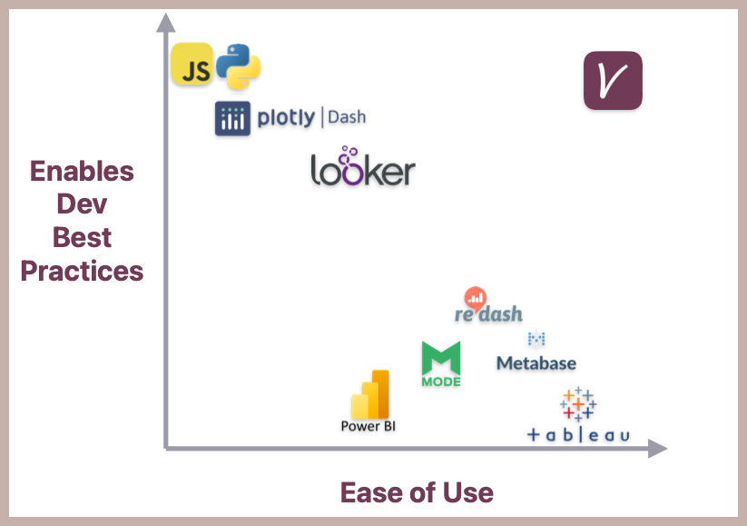

# Visivo

## What's Up With Data Vizualization? 

There's a number of code based frameworks for defining tranformations and for creating charts, but... They are very difficult to use, requiring technical experiance in 2-5 different programing languages, and require that you maintain infrastructure to support your internal BI product.

There's also a number of BI tools that are easy to use and deploy, However... 

1. They are not version controlled meaning that they sit outside of your transformation stack. This causes bottle necks in improving and expanding the transformation layer since it's unclear which charts depend on which models. 
1. They are not testable. This makes exposures like dasboards and analyses very expensive for the team to maintain. It also means that breaking changes in production go undectected until someone stumbles across them... if your lucky enough for somone to find them. 

We think that having to choose between building custom software and high quality data vizualization is a **big problem**.
 

We built visivo to bridge the gap between code based data visualization and usability. 

We firmly belive that to service modern data needs in both analytics and software enegineering we need to have version control in BI. However that cannot come at the expense of moving quickly. In fact we think that a code base approach actually helps you move faster, lower maintance costs, build more nuanced visualizations and unblock downstream engineering and data teams. 

### The Current Landscape
Business intelligence is critical. These days the charts that executives, engineers, product managers, analysts and others look at on a day to day basis faciliate decision making, catch breaking bugs and even power entire operations teams. BI today acts more as an internal product than the nice to have tool it was 10-30 years go.

Even so, BI hasnt changed much since tableau was released in 2005. It's largly the same product and newer companies like redash or mode have mostly copied the architecture.  

* Non-version controlled custom queries take an ineffeicent slice of the database and produce some charts using a GUI. 
* Chart configurations are not version controllable, or if they are it's half baked. 
* There's no testability and no way to deploy changes to different enviornments. 
* Breaking changes in production are common. 
* Refactors to transformations blows up downstream charts and there's no way to know that ex-ante. If you're lucky you will find out about these problems when your CEO goes looking for a chart to show to investors and then is confused when it "looks off". 
* If you're unlucky your CEO unknowingly reports the untest & incorrect data to investors. 

Visivo solves these problems by sitting right in your stack dbt, django or rails project and builds visualizations & dashboards right on top of your data. It's code and it's testable but it's no more complicated to use than popular BI tools. 

### The Modern Data Stack
From first principles, data visualization has two fundamental components:

* **`Transformation`** of a bigger data set into a thin compressed slice. _ie. sum sales amount by week from a transaction model where the sale occured in 2023._
* **`Configuration`** that defines chart atributes and customization. _ie. use bars vs. lines, line color equals blue ect._

## Our Guiding Values
We think that your data is important and data visualization is the last leg data pipeline. Dare we say that your data stack is as important as your product to sustaining long term repeatable success. It helps improve executive decisions, supports operations, bolsters engineer and enables a deep understanding of your customer, product, market and tech stack. 

With that in mind we think your data visualization should work like the rest of your stack. It should be:

1. `Testable` - It is code, and should be treated like it.
1. `Sharable` - Dashboards and config can be shared internally and externally.
1. `Adoptable` - We have a tool that fits into exisiting workflows.
1. `Scaleable` - Pricing and deployments are clear and predictable.
1. `Explainable` - It is easy to document and understand dependencies between transformations and visualizations.