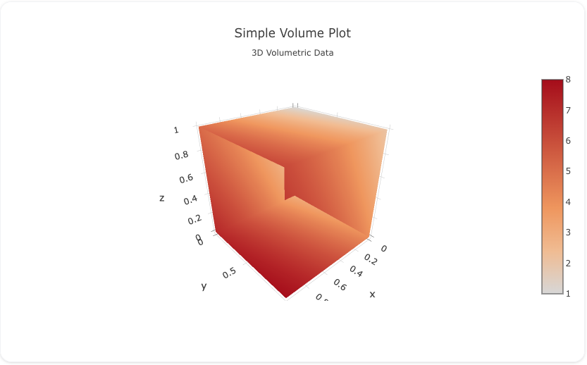

## Overview

The `volume` trace type is used to create 3D volume plots, which visualize 3D volumetric data. Volume plots are useful for representing datasets where the values at each (x, y, z) point in a grid represent a density or scalar field, such as medical imaging, fluid dynamics, and other scientific data.

You can customize the opacity, surface levels, and colors to effectively visualize the internal structure of the volume.

!!! tip "Common Uses"
    - **Medical Imaging**: Visualizing 3D scans such as MRI or CT data.
    - **Fluid Dynamics**: Representing 3D fields of density or pressure.
    - **Scientific Visualization**: Displaying any 3D scalar field or volumetric data.

_**Check out the [Attributes](../configuration/Trace/Props/Volume/#attributes) for the full set of configuration options**_

## Examples


!!! example "Common Configurations"

    === "Simple Volume Plot"

        Here's a simple `volume` plot visualizing a 3D scalar field:

        

        You can copy this code below to create this chart in your project:

        ```yaml
        models:
          - name: volume-data
            args:
              - echo
              - |
                x,y,z,value
                0,0,0,1
                0,1,0,2
                0,0,1,3
                1,1,1,4
                1,0,1,5
        traces:
          - name: Simple Volume Plot
            model: ref(volume-data)
            props:
              type: volume
              x: query(x)
              y: query(y)
              z: query(z)
              value: query(value)
        charts:
          - name: Simple Volume Chart
            traces:
              - ref(Simple Volume Plot)
            layout:
              title:
                text: Simple Volume Plot<br><sub>3D Volumetric Data</sub>
        ```

    === "Volume Plot with Custom Opacity"

        This example demonstrates a `volume` plot where the opacity of the volume is customized based on the scalar field values:

        

        Here's the code:

        ```yaml
        models:
          - name: volume-data-opacity
            args:
              - echo
              - |
                x,y,z,value
                0,0,0,1
                0,1,0,2
                0,0,1,3
                1,1,1,4
                1,0,1,5
        traces:
          - name: Volume Plot with Custom Opacity
            model: ref(volume-data-opacity)
            props:
              type: volume
              x: query(x)
              y: query(y)
              z: query(z)
              value: query(value)
              opacity: 0.7
        charts:
          - name: Volume Chart with Custom Opacity
            traces:
              - ref(Volume Plot with Custom Opacity)
            layout:
              title:
                text: Volume Plot with Custom Opacity<br><sub>Customized Transparency for Volume Data</sub>
        ```

    === "Volume Plot with Surface Levels"

        Here's a `volume` plot where surface levels are added to highlight different levels within the volume:

        

        Here's the code:

        ```yaml
        models:
          - name: volume-data-surface
            args:
              - echo
              - |
                x,y,z,value
                0,0,0,1
                0,1,0,2
                0,0,1,3
                1,1,1,4
                1,0,1,5
        traces:
          - name: Volume Plot with Surface Levels
            model: ref(volume-data-surface)
            props:
              type: volume
              x: query(x)
              y: query(y)
              z: query(z)
              value: query(value)
              surface:
                count: 5
        charts:
          - name: Volume Chart with Surface Levels
            traces:
              - ref(Volume Plot with Surface Levels)
            layout:
              title:
                text: Volume Plot with Surface Levels<br><sub>Surface Levels Highlighted in Volume</sub>
        ```


